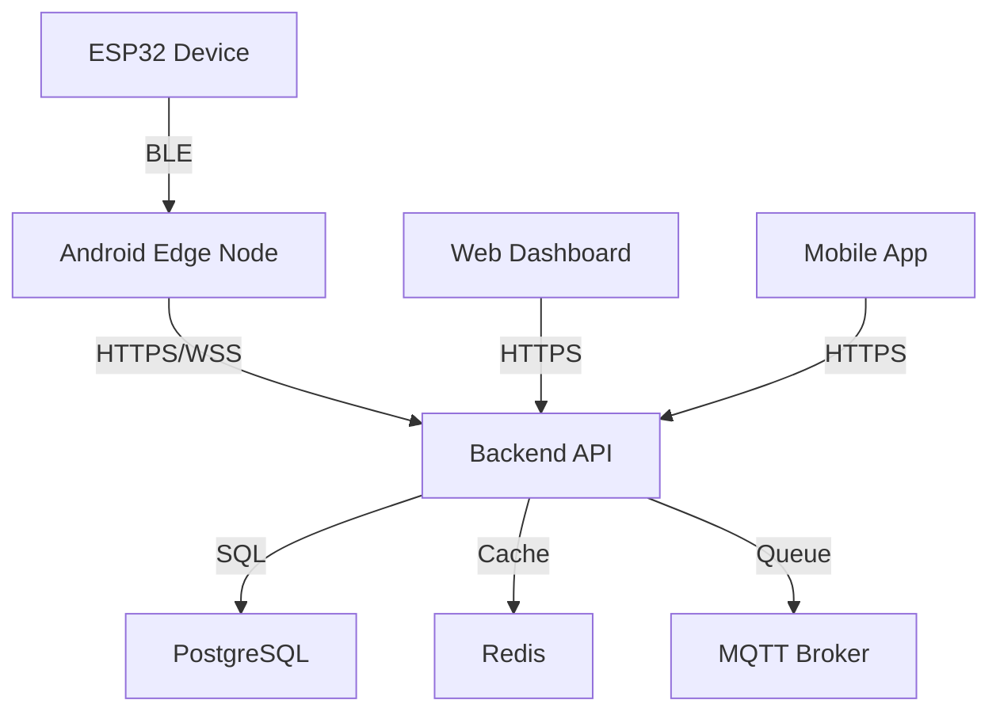

# OrthoTrack IoT Platform v3 - Product Requirements Document (PRD)

## 📋 Índice
- [1. Visão Geral do Produto](#1-visão-geral-do-produto)
- [2. Objetivos e Metas](#2-objetivos-e-metas)
- [3. Público-Alvo](#3-público-alvo)
- [4. Funcionalidades](#4-funcionalidades)
- [5. Requisitos Técnicos](#5-requisitos-técnicos)
- [6. Arquitetura do Sistema](#6-arquitetura-do-sistema)
- [7. Cronograma de Desenvolvimento](#7-cronograma-de-desenvolvimento)
- [8. Critérios de Sucesso](#8-critérios-de-sucesso)

---

## 1. Visão Geral do Produto

### 1.1 Problema
Pacientes com escoliose da AACD precisam usar coletes ortopédicos por longos períodos, mas há:
- Baixa aderência ao tratamento (compliance)
- Falta de monitoramento em tempo real
- Dificuldade para profissionais acompanharem o progresso
- Ausência de dados objetivos sobre uso dos dispositivos

### 1.2 Solução
Plataforma IoT completa que combina:
- **Dispositivos ESP32** embarcados nos coletes
- **Aplicativo Android** como gateway local
- **Backend GoLang** para processamento de dados
- **Dashboard Web** para profissionais de saúde
- **IA** para análise de padrões e alertas

### 1.3 Proposta de Valor
- **Monitoramento contínuo** do uso dos coletes
- **Alertas inteligentes** para baixo compliance
- **Análise de dados** com IA para otimizar tratamento
- **Interface intuitiva** para profissionais e pacientes
- **Arquitetura escalável** para múltiplas instituições

---

## 2. Objetivos e Metas

### 2.1 Objetivos Primários
- Aumentar a aderência ao tratamento em **30%**
- Reduzir tempo de consulta médica em **20%**
- Fornecer dados objetivos para 100% dos pacientes
- Detectar problemas de compliance em tempo real

### 2.2 Objetivos Secundários
- Melhorar satisfação do paciente
- Otimizar recursos médicos
- Gerar insights para pesquisa médica
- Expandir para outras aplicações ortopédicas

### 2.3 KPIs (Indicadores-Chave de Performance)
- **Taxa de Compliance**: % de uso conforme prescrição
- **Tempo de Detecção de Problemas**: < 24 horas
- **Disponibilidade do Sistema**: 99.5%
- **Satisfação do Usuário**: > 4.5/5
- **Redução de Consultas Desnecessárias**: 25%

---

## 3. Público-Alvo

### 3.1 Usuários Primários

#### 3.1.1 Profissionais de Saúde
- **Ortopedistas**: Acompanhar progresso dos pacientes
- **Fisioterapeutas**: Monitorar exercícios e compliance
- **Técnicos em Órteses**: Ajustar dispositivos
- **Administradores**: Gerenciar operação da clínica

#### 3.1.2 Pacientes e Cuidadores
- **Pacientes pediátricos**: Uso supervisionado
- **Pais/Responsáveis**: Monitorar filhos
- **Pacientes adultos**: Auto-monitoramento

### 3.2 Usuários Secundários
- **Pesquisadores**: Análise de dados agregados
- **Administradores de TI**: Manutenção do sistema
- **Suporte Técnico**: Resolução de problemas

---

## 4. Funcionalidades

### 4.1 Core Features (MVP)

#### 4.1.1 Monitoramento de Uso
- [x] Detecção automática de uso do colete
- [x] Registro de tempo de uso diário
- [x] Cálculo de compliance em tempo real
- [x] Histórico detalhado de sessões

#### 4.1.2 Coleta de Dados
- [x] Acelerômetro (movimento e postura)
- [x] Temperatura corporal
- [x] Sensores de pressão (ajuste do colete)
- [x] Bateria e status do dispositivo

#### 4.1.3 Alertas e Notificações
- [x] Bateria baixa (< 20%)
- [x] Baixo compliance (< 80% da prescrição)
- [x] Dispositivo desconectado
- [x] Anomalias nos sensores

#### 4.1.4 Dashboard Web
- [x] Visão geral de todos os pacientes
- [x] Detalhes individuais por paciente
- [x] Gráficos de compliance e tendências
- [x] Relatórios exportáveis

### 4.2 Advanced Features (v2)

#### 4.2.1 IA e Machine Learning
- [ ] Detecção de padrões de uso
- [ ] Predição de não-compliance
- [ ] Otimização de prescrições
- [ ] Análise de eficácia do tratamento

#### 4.2.2 Gamificação
- [ ] Sistema de pontos por compliance
- [ ] Metas e conquistas
- [ ] Comparação com outros pacientes
- [ ] Recompensas virtuais

#### 4.2.3 Integração
- [ ] API para sistemas hospitalares
- [ ] Integração com prontuários eletrônicos
- [ ] Export para estudos clínicos
- [ ] Telemedicina

---

## 5. Requisitos Técnicos

### 5.1 Requisitos Funcionais

#### 5.1.1 Performance
- Sistema deve suportar **1000+ dispositivos simultâneos**
- Latência máxima de **5 segundos** para alertas críticos
- Disponibilidade de **99.5%** (4.4 horas downtime/mês)
- Backup automático de dados a cada **6 horas**

#### 5.1.2 Segurança
- Criptografia **AES-256** para dados em trânsito
- Autenticação **JWT** com renovação automática
- Logs de auditoria para todas as operações
- Compliance com **LGPD/GDPR**

#### 5.1.3 Escalabilidade
- Arquitetura **microserviços** para componentes críticos
- Cache distribuído com **Redis**
- Load balancer para alta disponibilidade
- Auto-scaling baseado em demanda

### 5.2 Requisitos Não-Funcionais

#### 5.2.1 Usabilidade
- Interface responsiva para **mobile-first**
- Tempo de aprendizado < **30 minutos** para novos usuários
- Acessibilidade **WCAG 2.1 AA**
- Suporte a **múltiplos idiomas** (PT-BR, EN, ES)

#### 5.2.2 Compatibilidade
- **Android 8.0+** para aplicativo mobile
- **Browsers modernos** (Chrome 90+, Firefox 88+, Safari 14+)
- **ESP32** com Bluetooth 5.0+
- **PostgreSQL 12+** para banco de dados

---

## 6. Arquitetura do Sistema

### 6.1 Componentes Principais

#### 6.1.1 Hardware Layer
- **ESP32**: Microcontrolador com sensores integrados
- **Sensores**: MPU6050, DHT22, FSR, Hall Effect
- **Comunicação**: Bluetooth 5.0 LE + WiFi opcional

#### 6.1.2 Edge Layer
- **Android App**: Gateway local e interface do usuário
- **Edge Computing**: Processamento local de dados
- **Offline Storage**: SQLite para operação sem internet

#### 6.1.3 Backend Layer
- **API Gateway**: GoLang com Gin framework
- **Microservices**: Separados por domínio
- **Message Queue**: MQTT para comunicação assíncrona
- **Database**: PostgreSQL para dados estruturados

#### 6.1.4 Frontend Layer
- **Web Dashboard**: SvelteKit com Tailwind CSS
- **Mobile App**: React Native ou Flutter
- **Real-time**: WebSockets para updates em tempo real

### 6.2 Fluxo de Dados

1. **Coleta**: ESP32 coleta dados dos sensores
2. **Transmissão**: Dados enviados via BLE para Android
3. **Processamento**: Edge processing no Android
4. **Upload**: Dados sincronizados com backend via HTTPS
5. **Análise**: IA processa dados no backend
6. **Visualização**: Dashboard atualizado em tempo real
7. **Alertas**: Notificações enviadas quando necessário

---

## 7. Cronograma de Desenvolvimento

### 7.1 Fase 1: Fundação (Meses 1-2)
- [x] Setup do ambiente de desenvolvimento
- [x] Estrutura base dos projetos
- [ ] Modelos de dados e API básica
- [ ] Interface de usuário mockups
- [ ] Protótipo ESP32 básico

### 7.2 Fase 2: MVP (Meses 3-4)
- [ ] Backend completo com APIs
- [ ] Frontend básico funcional
- [ ] Aplicativo Android com BLE
- [ ] Firmware ESP32 com sensores
- [ ] Integração end-to-end

### 7.3 Fase 3: Features Avançadas (Meses 5-6)
- [ ] Sistema de alertas inteligentes
- [ ] IA para análise de padrões
- [ ] Dashboard analytics avançado
- [ ] Otimizações de performance
- [ ] Testes de carga

### 7.4 Fase 4: Produção (Meses 7-8)
- [ ] Deploy em ambiente de produção
- [ ] Monitoramento e observabilidade
- [ ] Documentação completa
- [ ] Treinamento de usuários
- [ ] Suporte e manutenção

---

## 8. Critérios de Sucesso

### 8.1 Critérios Técnicos
- [ ] Todas as APIs funcionando conforme especificação
- [ ] Cobertura de testes > 80%
- [ ] Performance dentro dos SLAs definidos
- [ ] Zero vazamentos de dados
- [ ] Deployment automatizado funcional

### 8.2 Critérios de Negócio
- [ ] Aumento de compliance medido em estudo piloto
- [ ] Feedback positivo de profissionais de saúde
- [ ] Redução de consultas desnecessárias
- [ ] ROI positivo para instituições
- [ ] Aprovação regulatória (se necessária)

### 8.3 Critérios de Usuário
- [ ] Facilidade de uso validada com testes
- [ ] Tempo de setup < 15 minutos
- [ ] Taxa de erros < 1%
- [ ] Satisfação do usuário > 4.5/5
- [ ] Adoção > 90% dos pacientes inscritos

---

## 📝 Histórico de Revisões

| Versão | Data | Autor | Descrição |
|--------|------|-------|-----------|
| 1.0 | 2024-03-01 | Equipe | Versão inicial do PRD |
| 1.1 | 2024-03-15 | Equipe | Refinamento após validação |

---

**Documento Proprietário - OrthoTrack IoT Platform v3**