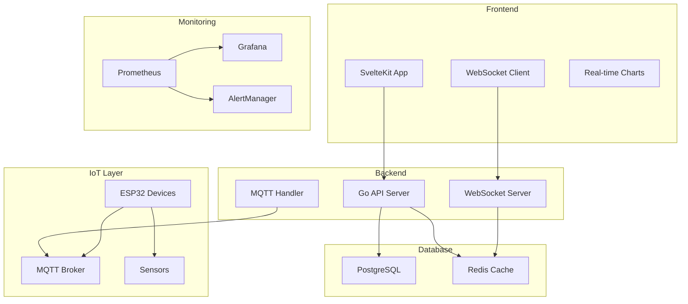

# 🏥 OrthoTrack IoT v3 - Sistema de Monitoramento Ortopédico

[](https://github.com/alexabreup/orthotrack-iot-v3/actions)
[](LICENSE)
[](package.json)

Sistema completo de monitoramento em tempo real para dispositivos ortopédicos IoT, desenvolvido para a AACD em parceria com o SENAI.

## 🌟 Características Principais

- 🔄 **Monitoramento em Tempo Real** - WebSocket para atualizações instantâneas
- 📊 **Dashboard Interativo** - Interface moderna com SvelteKit
- 🏥 **Gestão de Pacientes** - Sistema completo de cadastro e acompanhamento
- 📱 **Dispositivos IoT** - Integração com ESP32 e sensores
- 🔔 **Sistema de Alertas** - Notificações em tempo real
- 📈 **Analytics Avançado** - Relatórios e métricas detalhadas
- 🔒 **Segurança Robusta** - Autenticação JWT e criptografia
- 🚀 **Deploy Automático** - CI/CD com GitHub Actions
- 📊 **Monitoramento Completo** - Prometheus + Grafana + AlertManager

## 🏗️ Arquitetura



## 🚀 Quick Start

### Pré-requisitos

- Docker & Docker Compose
- Node.js 18+ (para desenvolvimento)
- Go 1.21+ (para desenvolvimento)
- Git

### Desenvolvimento Local

```bash
# 1. Clonar repositório
git clone https://github.com/alexabreup/orthotrack-iot-v3.git
cd orthotrack-iot-v3

# 2. Iniciar serviços de desenvolvimento
docker-compose up -d

# 3. Configurar backend
cd backend
cp .env.example .env
go mod download
go run cmd/api/main.go

# 4. Configurar frontend
cd ../frontend
npm install
npm run dev
```

### Deploy em Produção

O sistema possui deploy automático via GitHub Actions. Veja [GITHUB-DEPLOY-SETUP.md](GITHUB-DEPLOY-SETUP.md) para configuração completa.

```bash
# Deploy automático ao fazer push para main
git push origin main

# Deploy manual no VPS
ssh root@72.60.50.248
cd /opt/orthotrack
./scripts/deploy.sh -b  # Com backup
```

## 📁 Estrutura do Projeto

```
orthotrack-iot-v3/
├── 📱 frontend/                 # SvelteKit Frontend
│   ├── src/
│   │   ├── lib/
│   │   │   ├── components/      # Componentes reutilizáveis
│   │   │   ├── services/        # Serviços (API, WebSocket)
│   │   │   ├── stores/          # Stores Svelte (estado)
│   │   │   └── types/           # Tipos TypeScript
│   │   └── routes/              # Páginas da aplicação
│   └── Dockerfile
├── 🔧 backend/                  # Go Backend API
│   ├── cmd/api/                 # Ponto de entrada
│   ├── internal/
│   │   ├── handlers/            # Handlers HTTP
│   │   ├── middleware/          # Middlewares
│   │   ├── models/              # Modelos de dados
│   │   └── services/            # Lógica de negócio
│   └── Dockerfile
├── 🔌 esp32-firmware/           # Firmware ESP32
│   ├── src/                     # Código fonte C++
│   ├── test/                    # Testes do firmware
│   └── platformio.ini           # Configuração PlatformIO
├── 🐳 docker-compose.prod.yml   # Produção
├── 🌐 nginx.conf                # Configuração Nginx
├── 📊 monitoring/               # Monitoramento
│   ├── prometheus/
│   ├── grafana/
│   └── alertmanager/
├── 🔧 scripts/                  # Scripts de manutenção
│   ├── setup-vps.sh            # Setup inicial VPS
│   ├── deploy.sh               # Deploy manual
│   ├── backup.sh               # Backup automático
│   └── health-check.sh         # Verificação de saúde
└── 🚀 .github/workflows/        # GitHub Actions
    └── deploy-production.yml
```

## 🔧 Tecnologias Utilizadas

### Frontend
- **SvelteKit** - Framework web moderno
- **TypeScript** - Tipagem estática
- **Tailwind CSS** - Estilização
- **Chart.js** - Gráficos interativos
- **WebSocket** - Comunicação em tempo real

### Backend
- **Go** - Linguagem de programação
- **Gin** - Framework web
- **GORM** - ORM para banco de dados
- **Gorilla WebSocket** - WebSocket server
- **Redis** - Cache e pub/sub
- **JWT** - Autenticação

### Banco de Dados
- **PostgreSQL** - Banco principal
- **Redis** - Cache e sessões

### IoT
- **ESP32** - Microcontrolador
- **MQTT** - Protocolo de comunicação
- **Sensores** - MPU6050, BMP280, etc.

### DevOps
- **Docker** - Containerização
- **GitHub Actions** - CI/CD
- **Nginx** - Proxy reverso
- **Let's Encrypt** - SSL/TLS
- **Prometheus** - Métricas
- **Grafana** - Dashboards
- **AlertManager** - Alertas

## 📊 Monitoramento e Observabilidade

### Métricas Disponíveis
- **Sistema**: CPU, Memória, Disco, Rede
- **Aplicação**: Response time, Error rate, Throughput
- **Banco de Dados**: Conexões, Queries, Performance
- **IoT**: Dispositivos online, Bateria, Alertas

### Dashboards
- **Sistema Geral**: http://72.60.50.248:3001
- **Aplicação**: http://72.60.50.248:3000
- **API**: http://72.60.50.248:8080
- **Alertas**: Monitoramento de alertas

### Alertas Configurados
- 🚨 **Críticos**: Serviços down, Erro rate alto
- ⚠️ **Warnings**: CPU/Memória alta, Disco baixo
- 📱 **IoT**: Dispositivos offline, Bateria baixa

## 🔒 Segurança

### Medidas Implementadas
- **SSL/TLS** - Certificados Let's Encrypt
- **Firewall** - UFW configurado
- **Rate Limiting** - Nginx + Redis
- **Fail2Ban** - Proteção contra ataques
- **JWT** - Autenticação segura
- **CORS** - Configuração restritiva
- **Headers de Segurança** - CSP, HSTS, etc.

### Auditoria
- **Logs Centralizados** - Todos os eventos
- **Monitoramento** - Alertas em tempo real
- **Backup** - Automático diário
- **Health Checks** - Verificação contínua

## 📈 Performance

### Otimizações
- **Cache Redis** - Dados frequentes
- **CDN** - Assets estáticos
- **Compressão** - Gzip/Brotli
- **Lazy Loading** - Componentes sob demanda
- **WebSocket** - Comunicação eficiente
- **Database Indexing** - Queries otimizadas

### Métricas de Performance
- **Response Time**: < 200ms (95th percentile)
- **Availability**: > 99.9%
- **Concurrent Users**: 1000+
- **IoT Devices**: 10000+

## 🧪 Testes

### Frontend
```bash
cd frontend
npm test                    # Testes unitários
npm run test:e2e           # Testes E2E
npm run test:coverage      # Cobertura
```

### Backend
```bash
cd backend
go test ./...              # Testes unitários
go test -race ./...        # Race conditions
go test -bench ./...       # Benchmarks
```

### Property-Based Testing
- **Rapid (Go)** - Testes baseados em propriedades
- **Fast-check (TS)** - Testes de propriedades frontend

## 📚 Documentação

- [🚀 Setup de Deploy](GITHUB-DEPLOY-SETUP.md)
- [🏥 Deploy VPS](DEPLOY-VPS-PRODUCTION.md)
- [📊 Monitoramento](monitoring/README.md)
- [🔌 ESP32 Firmware](esp32-firmware/README.md)
- [🧪 Testes](backend/TEST_INSTRUCTIONS.md)
- [📋 Especificações](.kiro/specs/)

## 🤝 Contribuição

1. Fork o projeto
2. Crie uma branch para sua feature (`git checkout -b feature/AmazingFeature`)
3. Commit suas mudanças (`git commit -m 'Add some AmazingFeature'`)
4. Push para a branch (`git push origin feature/AmazingFeature`)
5. Abra um Pull Request

### Padrões de Código
- **Frontend**: ESLint + Prettier
- **Backend**: gofmt + golint
- **Commits**: Conventional Commits
- **Testes**: Obrigatórios para novas features

## 📄 Licença

Este projeto está licenciado sob a Licença MIT - veja o arquivo [LICENSE](LICENSE) para detalhes.

## 👥 Equipe

### Desenvolvimento
- **Backend**: Go + PostgreSQL + Redis
- **Frontend**: SvelteKit + TypeScript
- **IoT**: ESP32 + C++ + MQTT
- **DevOps**: Docker + GitHub Actions

### Parceiros
- **AACD** - Associação de Assistência à Criança Deficiente
- **SENAI** - Serviço Nacional de Aprendizagem Industrial

## 📞 Suporte

- **Email**: suporte@orthotrack.alexptech.com
- **Issues**: [GitHub Issues](https://github.com/alexabreup/orthotrack-iot-v3/issues)
- **Documentação**: [Wiki](https://github.com/alexabreup/orthotrack-iot-v3/wiki)

## 🎯 Roadmap

### v3.1.0 (Q1 2024)
- [ ] Machine Learning para predição de compliance
- [ ] App mobile nativo
- [ ] Integração com wearables
- [ ] API GraphQL

### v3.2.0 (Q2 2024)
- [ ] Multi-tenancy
- [ ] Relatórios avançados
- [ ] Integração HL7 FHIR
- [ ] Telemedicina

### v4.0.0 (Q3 2024)
- [ ] Microserviços
- [ ] Kubernetes
- [ ] Edge computing
- [ ] AI/ML integrado

---

<div align="center">

**🏥 OrthoTrack IoT v3** - Transformando o cuidado ortopédico através da tecnologia

[](https://aacd.org.br)
[](https://senai.br)

</div>